## Video Object Tracking
This repository is a part of a project about object tracking. 
More specificaly about grasping object in the wild.

<p align="center">
  
</p>

For the first part of this project, we trained the MobileNetV2 architecture on a database of crops of 


## Setting up the project

### 1. Clone the repository
```
git clone https://github.com/MohamedSerrari/video_object_tracking.git
```

### 2. Install the dependencies of the project. 

* We recommend to use anaconda to manage your python environments.

* If you have a gpu, install `tensorflow-gpu` instead of `tensorflow` in order to benefit from GPU acceleration.

```
pip install -r requirements.txt
```

### 3. Download the zip containing the labeled training and testing data:
```
https://dept-info.labri.fr/~mansenca/GITW_light/DB.zip
```

### 4. Unzip the zip file into the cloned repo

The structure of your folder must now look like the structure shown here. 

``` text
.
├── train.py
├── eval.py
├── requirements.txt
├── README.md
├── DB
│   ├── train
│   │   ├── Bowl
│   │   ├── CanOfCocaCola
│   │   ├── MilkBottle
│   │   ├── Rice
│   │   └── Sugar
│   └── test
│       ├── Bowl
│       ├── CanOfCocaCola
│       ├── MilkBottle
│       ├── Rice
│       └── Sugar
├── logs
├── utils
│   ├── utils.py
│   ├── convert_checkpoint.ipynb
│   ├── data_exploration.ipynb
│   └── make_gifs.ipynb
├── weights
│   └── mobilenet_model.h5
└── results
    ├── conf_mat.gif
    ├── epoch_accuracy.jpg
    └── epoch_loss.jpg
```

## Analyzing the dataset

### 1. Visualizing samples

| Class | Sample 1 | Sample 2 | Sample 3 | Sample 4 | Sample 5 | Sample 6 | Sample 7 | Sample 8 | Sample 9 | Sample 10 |
|:-:|:-:|:-:|:-:|:-:|:-:|:-:|:-:|:-:|:-:|:-:|
| Bowl | 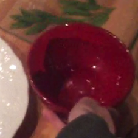 |  | 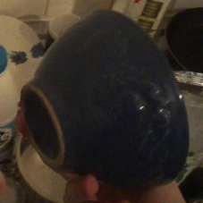 | 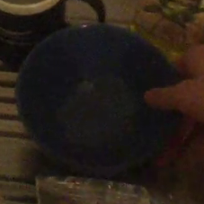 | 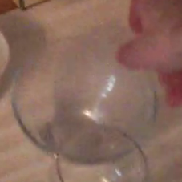 | 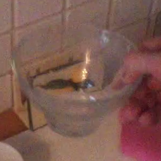 | 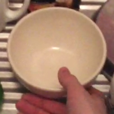 | 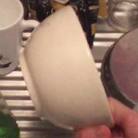 | 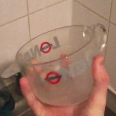 | 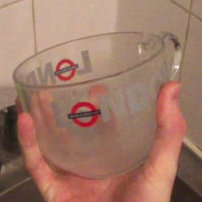 |
| CanOfCocaCola | 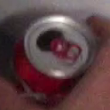 | 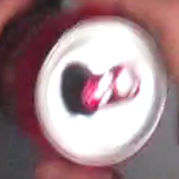 | 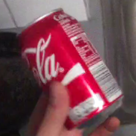 | 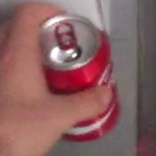 | 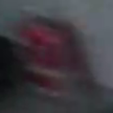 | 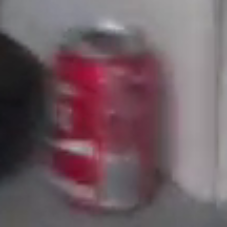 | 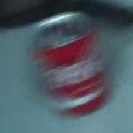 | 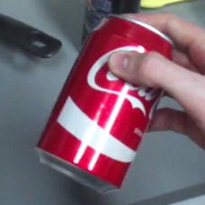 | 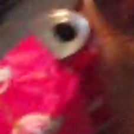 | 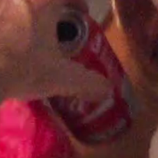 |
| MilkBottle | 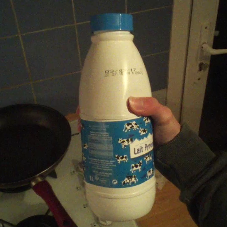 | 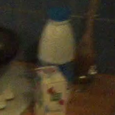 | 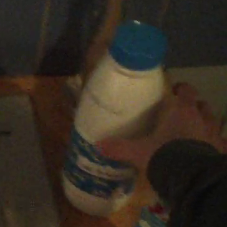 | 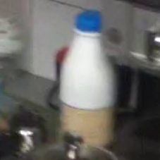 | 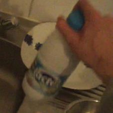 | 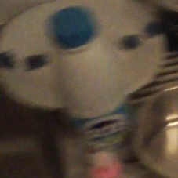 | 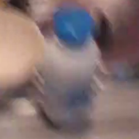 | 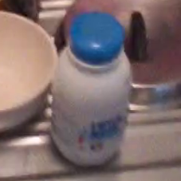 | 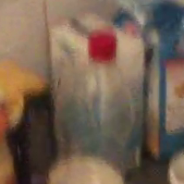 | 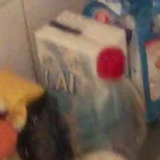 |
| Rice | 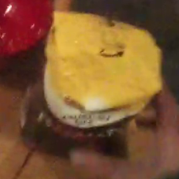 | 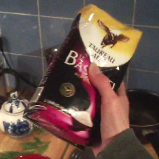 | 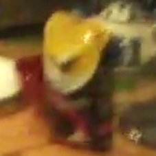 | 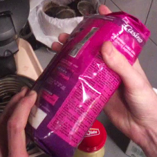 | 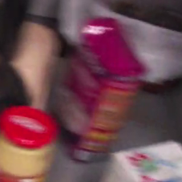 | 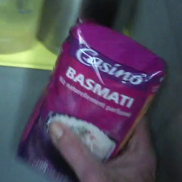 | 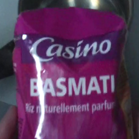 | 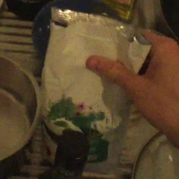 | 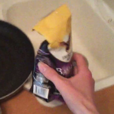 | 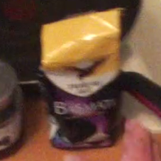 |
| Sugar | 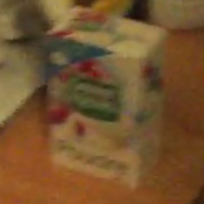 | 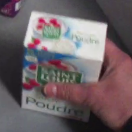 | 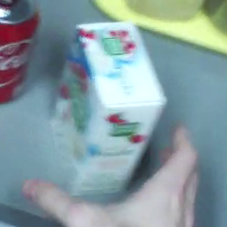 | 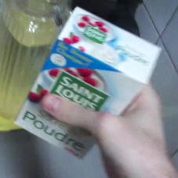 | 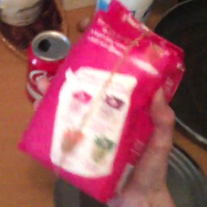 | 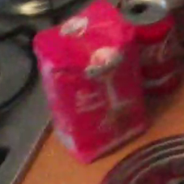 | 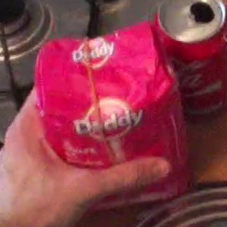 | 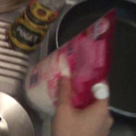 | 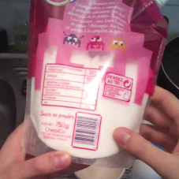 | 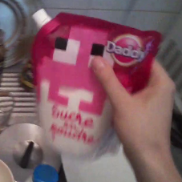 |


### 2. Class Distribution in Train and Test

There is a class imbalance between the training and testing data 

<p align="center">
  
</p>

### 3. Conclusions about data:

There are multiples issues with the data:

- Many images have motion blurr.

- The dataset suffers from inclass heterogenity. This is a direct effect of using data captured in the wild.

- Different lighting conditions.

- Class imbalance between train and test set.

## Training The Model

In order to train the model run the command

```python
python train.py
```

During training, the script will save checkpoints of the model and show the accuracy on the training and evaluation set via `TensorBoard`. To follow the training you can launch `TensorBoard` using the command:

```python
tensorboard --logdir=logs
```

Then Open a browser `http://localhost:6006/`


| Epoch Accuracy | Epoch Loss |
|:-------------------------:|:-------------------------:|
| 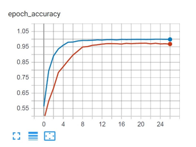 |  | 


<p align="center">
  
</p>


## Evaluating The Model

In order to evaluate the model run the command

```
python eval.py
```

<pre>
               precision    recall  f1-score   support

         Bowl       0.91      0.99      0.95       166

CanOfCocaCola       0.98      0.98      0.98       180

   MilkBottle       0.98      0.98      0.98       177

         Rice       1.00      0.92      0.96       251

        Sugar       0.98      1.00      0.99       226

     accuracy                           0.97      1000

    macro avg       0.97      0.97      0.97      1000

 weighted avg       0.97      0.97      0.97      1000
</pre>

## Object tracking

We developed three versions of object tracking.

### [Basic version of object tracking](object_tracking_basic.py)

The source code: [object_tracking_basic.py](object_tracking_basic.py)

This is the most basic version of our object tracking algorithms.

Once an object is annotated in the annotation file, the algorithm will keep track of it by exploring uniformly windows of different scales surrounding the object.

The exploration factor can be changed by modifying the steps.

For example steps = [0, 0.1, 0.5, 1.0] will tell the algorithm to search the window that is on top of the original annotation, the widows that on top bottom left right but slighly translated with ± 0.1 width / height of the original box and so on.

The explored windows are then given to a pretrained model that will give a score for each one.

The window with the highest score is used as the next box.

### [Object tracking with motion compensation](object_tracking_motion_compensation.py)

The source code: [object_tracking_motion_compensation.py](object_tracking_motion_compensation.py)

This is a more advanced version of the object tracking algorithm.

In this version, instead of having constant exploration steps. The steps are scaled for every frame according to the ammount of global movement of the frame. For frames with a lot of movement the steps are greater.

To calculate the global motion between two frames we used Gunnar Farneback’s algorithm to calculate dense optical flow combined with KMeans clustering to find global motion. We were inspired by this [Tutorial](https://medium.com/roonyx/camera-motion-estimation-using-optical-flow-ce441d7ffec).

### [Object tracking with motion compensation and Box averaging V1.0](object_tracking_motion_compensation_averaging.py)

The source code: [object_tracking_motion_compensation_averaging.py](object_tracking_motion_compensation_averaging.py)

In the previous version of object tracking, we noticed that multiple boxes had a score greater than 0.9 and sometimes equal to 1. This meant that the first box of with maximum confidence was not the best box. Consequently the tracking was not great.

In this version we tried a first solution to this problem.

We took the box that was in the center of all the boxes with score higher than 0.5

This box was created by averaging the coordinates (x, y) and dimensions (width, height) of the good boxes.

As a result, we got better tracking with less sensitive to boxes with very good scores.

### [Object tracking with motion compensation and Box averaging V2.0](object_tracking_motion_compensation_averagingv2.py)

The source code: [object_tracking_motion_compensation_averagingv2.py](object_tracking_motion_compensation_averagingv2.py)

In this second version, we tried an even better averaging method.

We used a weighted average instead of using a uniform average and the weights used were the scores given by the model.

We also scaled the weights by taking their power to 4 so as to give boxes with higher score even more weight.

We modified the way we average the boxes. Previously we used xywh coordinates directly, now we use cxcywh coordinates so as to not get biased towards the left side of the box.

### Results

Click the link to watch the video : [Tracking sugar in plastic bag](https://drive.google.com/file/d/1naqpvu7qs0XzeDpXXM39d6VvEj2dkNIx/view?usp=sharing)


Click the link to watch the video : [Tracking sugar in cardboard box](https://drive.google.com/file/d/1GlRXBUwFWnJXBWIs20julQ3hp91J6vjZ/view?usp=sharing)


Click the link to watch the video : [Tracking coca and lost](https://drive.google.com/file/d/1nSDrQd_O5XC887f5pYh6-hKh3z5B-0fZ/view?usp=sharing)


### Ways to improve tracking

* Active learning : retrain the model during the tracking
* Move to data : A different way to do active learning
* Compare to opencv trackers
* Use polynomial interpolation to stabilize the tracking
* Make forward and backward predictions (Look in the future frames to make more precise predictions)


## Resources

`https://dept-info.labri.fr/~mansenca/GITW_light`
